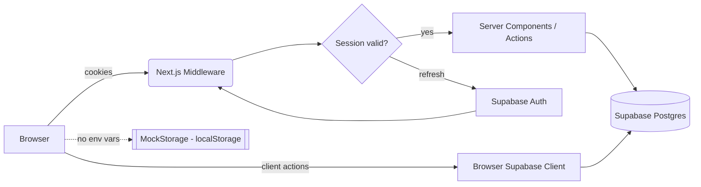

<div align="center">


# 🏔️ TrailMate

### Outdoor Trip Planning & GPS Trail Tracking, Reimagined


<br />

[](https://nextjs.org/)
[](https://www.typescriptlang.org/)
[](https://supabase.com/)
[](https://tailwindcss.com/)
[](./LICENSE)

[](https://github.com/Crusty-chirayu/TrailMate/stargazers)
[](https://github.com/Crusty-chirayu/TrailMate/network/members)
[](https://github.com/Crusty-chirayu/TrailMate/commits/main)
[](https://github.com/Crusty-chirayu/TrailMate/issues)

<br />


</div>

---

## 🚧 Project Status

> **TL;DR: Core is working, polish is in progress.**

<div align="center">

| Module | Status | Progress |
|---|---|---|
| Auth & Session System | ✅ Stable |  |
| Dashboard | ✅ Stable |  |
| Trips Manager | ✅ Stable |  |
| GPS Trail Recorder | 🟡 Functional, needs map view |  |
| Gear & Checklist Manager | ✅ Stable |  |
| Local Scaffolding / Offline Mode | ✅ Stable |  |
| Map Visualizer (Leaflet/Mapbox) | ⬜ Not started |  |
| GPX / KML Export & Import | ⬜ Not started |  |
| Elevation Profile Chart | ⬜ Not started |  |
| Offline PWA Support | ⬜ Not started |  |

**Overall: ~65% toward the v1.0 milestone** (core CRUD + auth + GPS logging + gear tracking are done; map visualization, export, and PWA support are the remaining big pieces).

</div>

> 🛠️ A heads-up for anyone watching this repo: development is currently a little slower than usual — the maintainer ([@Crusty-chirayu](https://github.com/Crusty-chirayu)) is juggling a few other projects and some unforeseen interruptions at the moment. TrailMate isn't abandoned — active development and deployment are planned to resume and this project **will** be completed and shipped. Stars, issues, and PRs are very welcome in the meantime and help keep momentum going! ⭐

---

## Table of Contents

- [Overview](#overview)
- [Tech Stack](#tech-stack)
- [Architecture](#architecture)
- [File Tree](#file-tree)
- [Database Schema](#database-schema)
- [Core Feature Modules](#core-feature-modules)
- [Getting Started](#getting-started)
- [Environment Variables](#environment-variables)
- [Database Setup](#database-setup)
- [Development](#development)
- [Production Build](#production-build)
- [Local Scaffolding / Offline Mode](#local-scaffolding--offline-mode)
- [Roadmap](#roadmap)
- [Contributing](#contributing)
- [License](#license)

---

## Overview

| | |
|---|---|
| **Project** | TrailMate |
| **Tagline** | Outdoor Trip Planning & GPS Trail Tracking Web Platform |
| **Use Cases** | 🥾 Trekking · 🚶 Hiking · 🚴 Mountain Biking / Cycling · ⛺ Camping & Backpacking |
| **Core Value** | Plan trips, log GPS waypoints (lat/lng/elevation/timestamp), manage gear packing lists, sync with Supabase Postgres — or run fully offline in Local Scaffolding Mode |

---

## Tech Stack

<div align="center">

    

</div>

| Layer | Technology |
|---|---|
| Framework | Next.js 14 (App Router, Server & Client Components) |
| Language | TypeScript — strict mode, full DB type safety |
| Styling | Tailwind CSS — dark theme (Slate‑950/900 bg, Emerald accents, Amber tracking indicators, Purple gear highlights) |
| Icons | `lucide-react` |
| Backend & Auth | Supabase (PostgreSQL + Supabase Auth + `@supabase/ssr` v0.12+) |
| Session Management | Next.js Middleware (`src/middleware.ts`) + `createServerClient` (server) + `createBrowserClient` (client singleton) + custom `useAuth()` hook |

---

## Architecture

TrailMate follows the Next.js App Router convention with a clean separation between:

- **Server-rendered pages** for data-heavy views (dashboard, trip lists)
- **Client components** for interactive features (GPS tracking, gear checklists)
- **A dual-mode data layer** — Supabase Postgres when configured, transparent `localStorage` fallback (`MockStorage`) when it isn't

Session state flows through three coordinated layers:

1. **Middleware** (`src/middleware.ts` → `lib/supabase/middleware.ts`) refreshes auth cookies on every request via `getAll` / `setAll` handlers.
2. **Server client** (`lib/supabase/server.ts`) reads cookies for RSC/server actions.
3. **Browser singleton** (`lib/supabase/client.ts`) + `useAuth()` hook keeps client components in sync via `getSession()` and `onAuthStateChange()`.



---

## File Tree

```
trailmate/
├── .env.example                  # Template for Supabase credentials
├── .env.local                    # Active local env (NEXT_PUBLIC_SUPABASE_URL & ANON_KEY)
├── next.config.mjs                # Next.js configuration
├── package.json                   # Project dependencies
├── postcss.config.mjs             # PostCSS configuration for Tailwind
├── tailwind.config.ts             # Tailwind CSS configuration
├── tsconfig.json                  # TypeScript compiler config
├── supabase/
│   └── schema.sql                 # Full PostgreSQL table DDL, RLS policies & indexes
└── src/
    ├── middleware.ts              # Root middleware invoking updateSession
    ├── app/
    │   ├── layout.tsx             # App Shell wrapper with sticky top Navigation & Footer
    │   ├── page.tsx               # Dashboard (Metrics cards, recent trips, quick actions)
    │   ├── globals.css            # Global Tailwind directives & dark mode variables
    │   ├── login/page.tsx         # Supabase Auth Log In page (Suspense boundary wrapped)
    │   ├── signup/page.tsx        # Supabase Auth Sign Up page
    │   ├── auth/
    │   │   └── callback/          # Auth callback route handler for PKCE code exchange
    │   ├── trips/
    │   │   ├── page.tsx           # Trips List (filterable by status & activity)
    │   │   ├── new/page.tsx       # New Trip Planner form with live session status
    │   │   └── [id]/page.tsx      # Trip Detail & GPS Route Point Logger
    │   └── gear/
    │       └── page.tsx           # Gear Template & Packing List Manager
    ├── components/
    │   └── Navigation.tsx         # Responsive Navbar with live auth indicator & mobile drawer
    ├── lib/
    │   ├── hooks/
    │   │   └── useAuth.ts         # Unified hook for session state & auth changes
    │   ├── supabase/
    │   │   ├── client.ts          # Browser client singleton (createBrowserClient)
    │   │   ├── server.ts          # Server client for App Router (createServerClient + cookies)
    │   │   └── middleware.ts      # Session refresh middleware (getAll/setAll cookie handlers)
    │   └── mockStore.ts           # LocalStorage fallback store for unauthenticated scaffolding
    └── types/
        └── database.ts            # TypeScript database models and interfaces
```

---

## Database Schema

TrailMate runs on PostgreSQL via Supabase with **Row Level Security (RLS)** enabled on every table. Full DDL lives in [`supabase/schema.sql`](./supabase/schema.sql).

### `trips`

| Column | Type | Notes |
|---|---|---|
| `id` | UUID | PK, `gen_random_uuid()` |
| `user_id` | UUID | FK → `auth.users(id)` ON DELETE CASCADE, NOT NULL |
| `title` | TEXT | NOT NULL |
| `activity_type` | TEXT | NOT NULL, CHECK IN `'trekking'`, `'cycling'`, `'camping'`, `'other'` |
| `planned_date` | DATE | Nullable |
| `status` | TEXT | NOT NULL, DEFAULT `'planned'`, CHECK IN `'planned'`, `'active'`, `'completed'`, `'cancelled'` |
| `created_at` | TIMESTAMPTZ | DEFAULT `now()` |

**Indexes:** `idx_trips_user_id`, `idx_trips_status`

### `route_points` (GPS Waypoints)

| Column | Type | Notes |
|---|---|---|
| `id` | UUID | PK, `gen_random_uuid()` |
| `trip_id` | UUID | FK → `trips(id)` ON DELETE CASCADE, NOT NULL |
| `lat` | DOUBLE PRECISION | NOT NULL |
| `lng` | DOUBLE PRECISION | NOT NULL |
| `elevation` | DOUBLE PRECISION | Nullable |
| `recorded_at` | TIMESTAMPTZ | DEFAULT `now()` |
| `synced` | BOOLEAN | DEFAULT `true` |

**Indexes:** `idx_route_points_trip_id`, `idx_route_points_recorded_at`

### `gear_templates`

| Column | Type | Notes |
|---|---|---|
| `id` | UUID | PK, `gen_random_uuid()` |
| `user_id` | UUID | FK → `auth.users(id)` ON DELETE CASCADE, NOT NULL |
| `name` | TEXT | NOT NULL |
| `created_at` | TIMESTAMPTZ | DEFAULT `now()` |

**Indexes:** `idx_gear_templates_user_id`

### `gear_items`

| Column | Type | Notes |
|---|---|---|
| `id` | UUID | PK, `gen_random_uuid()` |
| `template_id` | UUID | FK → `gear_templates(id)` ON DELETE CASCADE, NOT NULL |
| `item_name` | TEXT | NOT NULL |
| `checked` | BOOLEAN | DEFAULT `false` |
| `created_at` | TIMESTAMPTZ | DEFAULT `now()` |

**Indexes:** `idx_gear_items_template_id`

### Entity Relationship Diagram

```
auth.users
    │ 1
    │
    ├──────────────┐
    │ N             │ N
┌───▼─────┐   ┌─────▼──────────┐
│  trips  │   │ gear_templates │
└───┬─────┘   └─────┬──────────┘
    │ 1               │ 1
    │ N               │ N
┌───▼──────────┐ ┌────▼───────┐
│ route_points │ │ gear_items │
└──────────────┘ └────────────┘
```

### Row Level Security Policies

| Table | Policy Logic |
|---|---|
| `trips` | `auth.uid() = user_id` for SELECT / INSERT / UPDATE / DELETE |
| `route_points` | `EXISTS (SELECT 1 FROM trips WHERE trips.id = route_points.trip_id AND trips.user_id = auth.uid())` |
| `gear_templates` | `auth.uid() = user_id` for SELECT / INSERT / UPDATE / DELETE |
| `gear_items` | `EXISTS (SELECT 1 FROM gear_templates WHERE gear_templates.id = gear_items.template_id AND gear_templates.user_id = auth.uid())` |

---

## Core Feature Modules

### 1. 🔐 Auth & Session System
- Email & password sign up / log in via Supabase Auth.
- Browser singleton Supabase client — prevents duplicate client instances.
- Unified `useAuth()` hook: initializes session via `getSession()`, listens for changes via `onAuthStateChange()`.
- `updateSession` middleware refreshes `@supabase/ssr` cookies on every server request.
- 300ms cookie flush delay on login to avoid redirect race conditions.

### 2. 📊 Dashboard (`/`)
- Summary cards: Total Trips, Active Tracking sessions, Planned Adventures, Gear Templates.
- Recent Outdoor Activities feed with activity tags and live status badges.
- Quick-action shortcuts to create a trip or manage gear.

### 3. 🗺️ Trips Manager (`/trips`, `/trips/new`)
- Filter by Status (Planned / Active / Completed / Cancelled) and Activity Type (Trekking / Cycling / Camping / Other).
- Trip creation bound to `auth.uid()`, with live auth status indicator.
- Delete trips with confirmation modal.

### 4. 📍 GPS Trail Recorder (`/trips/[id]`)
- Route stats: total waypoints, latest elevation (m), current coordinates.
- Start/Stop GPS Tracking toggle using `navigator.geolocation`.
- Synthetic fallback GPS generator when location permission is denied.
- Manual waypoint entry (lat / lng / elevation).
- Route Points table: Waypoint #, Lat, Lng, Elevation, Timestamp, Sync state.

### 5. 🎒 Gear & Checklist Manager (`/gear`)
- Create/delete gear templates (e.g. "3-Season Backpacking", "Day Cycling").
- Add items inline; toggle checked state.
- Real-time packing progress bar (% ready).

### 6. 💾 Local Scaffolding / Fallback Mode
- Missing or placeholder Supabase env vars → app auto-switches to `MockStorage` (`localStorage`-backed).
- Enables offline UI testing without crashing or requiring a live backend.

---

## Getting Started

### Prerequisites

- Node.js 18+ or 20+
- npm 10+
- A Supabase project — free tier at [supabase.com](https://supabase.com)

### Installation

```bash
git clone https://github.com/Crusty-chirayu/TrailMate.git
cd TrailMate
npm install
```

---

## Environment Variables

Create a `.env.local` file in the project root:

```env
NEXT_PUBLIC_SUPABASE_URL=https://your-project-ref.supabase.co
NEXT_PUBLIC_SUPABASE_ANON_KEY=your-supabase-anon-key
```

> A `.env.example` template is included — copy it and fill in your project credentials. If these values are left unset, TrailMate automatically falls back to **Local Scaffolding Mode**.

---

## Database Setup

1. Open your Supabase project → **SQL Editor**.
2. Open [`supabase/schema.sql`](./supabase/schema.sql) from this repo.
3. Paste the contents into the SQL Editor and click **Run**.
4. Confirm the following exist under the `public` schema:
   - Tables: `trips`, `route_points`, `gear_templates`, `gear_items`
   - RLS policies on all four tables
   - Indexes listed in [Database Schema](#database-schema)

---

## Development

```bash
npm run dev
```

Open [http://localhost:3000](http://localhost:3000) in your browser.

---

## Production Build

```bash
npm run build
npm start
```

---

## Local Scaffolding / Offline Mode

If `NEXT_PUBLIC_SUPABASE_URL` / `NEXT_PUBLIC_SUPABASE_ANON_KEY` are missing or left as placeholder values, TrailMate transparently swaps its data layer for `lib/mockStore.ts`, a `localStorage`-backed store. This lets you:

- Evaluate the full UI without a Supabase project
- Test trip/gear/GPS flows offline
- Avoid runtime crashes in environments without configured credentials

No code changes are required to switch between modes — it's detected automatically at runtime.

---

## Roadmap

Future extension points for the next milestone:

- ⬜ **Interactive Map Visualizer** — integrate Leaflet / `react-leaflet` or Mapbox GL on `/trips/[id]` to draw polylines between recorded `route_points`.
- ⬜ **GPX / KML Export & Import** — export waypoints to `.gpx` for Garmin/Strava compatibility; import `.gpx` to pre-populate planned routes.
- ⬜ **Elevation Profile Chart** — use `recharts` to plot elevation vs. distance/timestamp.
- ⬜ **Offline PWA Support** — add Service Workers via `@ducanh2912/next-pwa` so GPS tracking keeps working without cellular coverage.
- ⬜ **Trip Sharing & Public Trails** — add an `is_public` boolean to `trips` to enable shareable public trail URLs.

These are the remaining pieces before a full v1.0 tag — deployment and completion are actively planned once the maintainer's schedule frees back up.

---

## Contributing

1. Fork the repository and create a feature branch.
2. Keep TypeScript strict mode passing (`npm run build`).
3. Follow the existing Tailwind dark-theme palette (Slate‑950/900, Emerald, Amber, Purple) for UI additions.
4. Open a pull request with a clear description of the change and any schema migrations required.

Contributions, issue reports, and even just a ⭐ are genuinely appreciated while active development is a bit slower than usual — they help keep this project moving toward a full release.

---

## License

MIT — see `LICENSE` for details.

<div align="center">

---

Made with 🥾 by [Crusty-chirayu](https://github.com/Crusty-chirayu)


</div>
